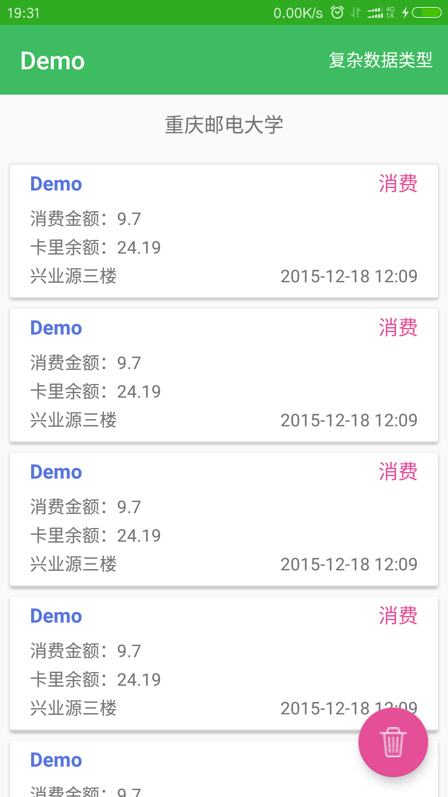

# RefreshRecyclerView
> - RecyclerAdapter : 支持下拉刷新，上拉加载，添加Header，Footer
> - MultiTypeAdapter : 针对复杂数据类型的数据列表
        
## 使用方法

 - gradle依赖

```
   compile 'com.github.goEcar:EcarRecyclerView:1.0.0'

```

 - xml布局文件

```xml
    <com.ecar.recycler.RefreshRecyclerView
        android:id="@+id/recycler_view"
        android:layout_width="match_parent"
        android:layout_height="wrap_content"
        app:refresh_able="true"
        app:load_more_able="false"/>
```
         
 - java代码

```
   mRecyclerView = (RefreshRecyclerView) findViewById(R.id.recycler_view);
        mAdapter = new CardRecordAdapter(this);
        listViewManager = new ListViewManager(this, mRecyclerView, mAdapter);
//        添加Header
        final TextView textView = new TextView(this);
        textView.setLayoutParams(new LinearLayoutCompat.LayoutParams(ViewGroup.LayoutParams.MATCH_PARENT, 100));
        textView.setTextSize(16);
        textView.setGravity(Gravity.CENTER);
        textView.setText("我是header");
        listViewManager.setHeader(textView);

        //添加footer
        final TextView footer = new TextView(this);
        footer.setLayoutParams(new LinearLayoutCompat.LayoutParams(ViewGroup.LayoutParams.MATCH_PARENT, 100));
        footer.setTextSize(16);
        footer.setGravity(Gravity.CENTER);
        footer.setText("我是Footer");
        listViewManager.setFooter(footer);

        //顶部颜色
        listViewManager.setTopColor(getResources().getColor(R.color.blue_light),
                getResources().getColor(R.color.blue_light),
                getResources().getColor(R.color.grey));

        //下拉刷新
        listViewManager.setTopRefresh(new Action() {
            @Override
            public void onAction() {
                listViewManager.getData(true, Arrays.asList(getVirtualData()));
            }
        });

        //上拉加载
        listViewManager.setMoreData(new Action() {
            @Override
            public void onAction() {
                listViewManager.getData(false, Arrays.asList(getVirtualData()));
                listViewManager.page++;
            }
        });

        //是否允许上拉加载
        listViewManager.setEnableMore(false);
        //是否允许下拉刷新
        listViewManager.setEnableRefresh(true);

        // 设置listview为空的时候显示的view
        listViewManager.setEmptyView(findViewById(R.id.iv_empty));


        //初始化数据
        listViewManager.initData(Arrays.asList(getVirtualData()));

```
                
###RecyclerAdapter

>针对相同数据类型列表，可添加Header，Footer

自定义Adapter应该继承RecyclerAdapter<T>，如：

```java
class CardRecordAdapter extends RecyclerAdapter<Consumption> {

    public CardRecordAdapter(Context context) {
        super(context);
    }

    @Override
    public BaseViewHolder<Consumption> onCreateBaseViewHolder(ViewGroup parent, int viewType) {
        return new CardRecordHolder(parent);
    }
}
```
###修改提示上拉布局需要重写view_status_last.xml布局，id保持不变
```java
   <LinearLayout
        android:id="@+id/load_more_view"
        android:layout_width="match_parent"
        android:layout_height="60dp"
        android:gravity="center"
        android:orientation="horizontal"
        android:padding="8dp"
        android:visibility="gone">


        <TextView
            android:layout_width="wrap_content"
            android:layout_height="wrap_content"
            android:layout_marginLeft="16dp"
            android:text="正在加载，这个修改过..."
            android:textSize="16sp" />

    </LinearLayout>

    <TextView
        android:id="@+id/no_more_view"
        android:layout_width="match_parent"
        android:layout_height="60dp"
        android:gravity="center"
        android:text="没有更多了~这个修改过"
        android:textSize="16sp"
        android:visibility="gone" />
```
###ViewHolder

>自定义ViewHolder需继承BaseViewHolder<T>，如：

 ```java
 class CardRecordHolder extends BaseViewHolder<Consumption> {

     //当使用MultiTypeAdapter时，务必加上此构造方法
     public CardRecordHolder(ViewGroup parent) {
         super(parent, R.layout.holder_consume);
     }

     @Override
     public void setData(Consumption object) {
         super.setData(object);
         name.setText("Demo");
         //UI绑定数据
     }

     @Override
     public void onInitializeView() {
         super.onInitializeView();
         name = findViewById(R.id.name);
         //初始化View
     }

     @Override
     public void onItemViewClick(Consumption object) {
         super.onItemViewClick(object);
         //点击事件
     }
 }
 ```
 **注意**：MultiTypeAdapter的ViewHolder的构造函数保证能反射时获取，应该写成静态或者public的单独类


### 注意事项

 - 依赖了其他库

```
    compile 'com.android.support:recyclerview-v7:23.4.0'
    compile 'com.android.support:support-annotations:23.4.0'
```


